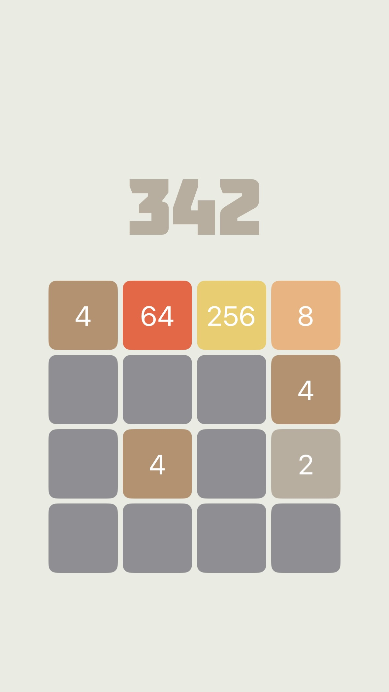
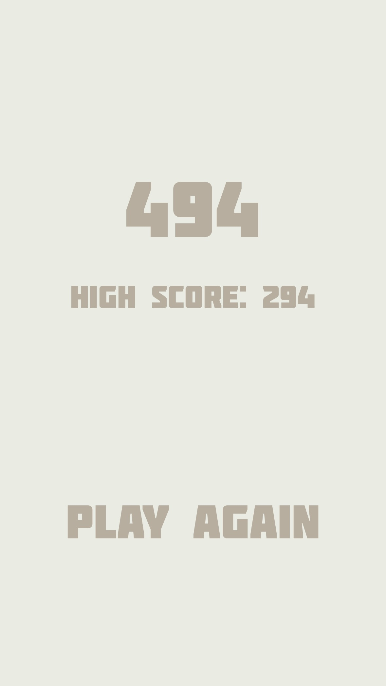

# X2048

X2048 is a beautifully designed iOS puzzle game inspired by the classic 2048. Built entirely with Swift and SwiftUI, it features soothing colors, and haptic feedback for an immersive gaming experience.

## Table of Contents

- [Features](#features)
- [Screenshots](#screenshots)
- [Requirements](#requirements)
- [Installation](#installation)
- [Gameplay](#gameplay)
- [Technologies Used](#technologies-used)
- [Project Structure](#project-structure)
- [License](#license)
- [Acknowledgments](#acknowledgments)

## Features

- **SwiftUI Interface**: Built entirely with SwiftUI for modern and efficient UI code.
- **Custom Fonts and Colors**: Aesthetically pleasing design with custom fonts and a soothing color palette.
- **Haptic Feedback**: Tactile responses for user interactions.
- **Game Screens**:
  - Splash Screen
  - Main Game Screen
  - Game Over Screen displaying current and high scores
- **Persistent High Score**: High scores are saved between game sessions.

## Screenshots

| Splash Screen                                   | Main Game Screen                     | Game Over Screen                               |
| ----------------------------------------------- | ------------------------------------ | ---------------------------------------------- |
|  |  |  |

## Requirements

- **macOS** with the latest version of **Xcode** installed.
- **iOS device** running **iOS 13.0** or later (for SwiftUI compatibility).
- An **Apple Developer account** (if you wish to run the app on a physical device).

## Installation

1. **Clone the Repository**

   ```
   git clone https://github.com/KhanShaheb34/X2048.git
   ```

2. **Open the Project in Xcode**

   - Navigate to the cloned directory.
   - Double-click on `X2048.xcodeproj` to open the project in Xcode.

3. **Install Dependencies**

   - No external dependencies are required for this project.

4. **Build and Run**

   - Select your target device (Simulator or physical iPhone).
   - Click on the **Run** button (▶️) in the toolbar or press `Command + R`.

## Gameplay

- **Objective**: Slide numbered tiles on a grid to combine them and create a tile with the number 2048.
- **How to Play**:
  - **Swipe Gestures**: Use swipe gestures (up, down, left, right) to move the tiles.
  - **Merging Tiles**: When two tiles with the same number touch, they merge into one.
  - **Game Over**: The game ends when there are no possible moves left.
  - **Scoring**: Your score increases each time you merge tiles.
  - **High Score**: The game tracks and displays your highest score achieved.

## Technologies Used

- **Swift 5**
- **SwiftUI**
- **Xcode**
- **UIKit** (for haptic feedback)
- **UserDefaults** (for persistent storage of high scores)

## Project Structure

- **`ContentView.swift`**: Handles the main view and navigation between screens.
- **`GameView.swift`**: Contains the game logic and UI for the main game screen.
- **`SplashScreen.swift`**: Displays the splash screen on app launch.
- **`GameOverView.swift`**: Shows the game over screen with current and high scores.
- **`GridView.swift`**: Renders the game grid and tiles.
- **`GameLogic.swift`**: Implements the game mechanics and logic.
- **`Assets.xcassets`**: Contains images, app icons, and color sets.

## License

This project is licensed under the MIT License - see the [LICENSE](LICENSE) file for details.

## Acknowledgments

- Inspired by the original [2048 game](https://play2048.co/).
- Thanks to ChatGPT (o1-preview) for teaching me how to code in swift.
